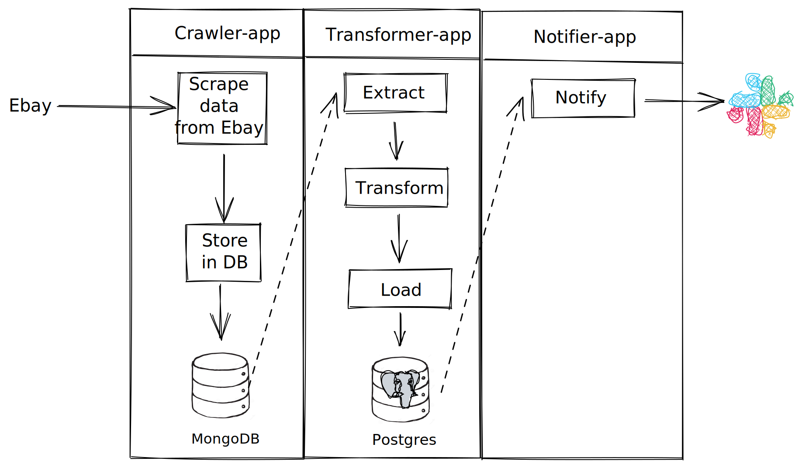

## Second-hand-bikes pipeline
This pipeline monitors ebay-kleinanzeige.de website for second-hand bikes ads. For ads from Berlin it sends slack notifications.



### Components
* Crawler app - scrapes a website and stores data to NoSQL (MongoDB) database.
* Transformer app - incrementally pulls data from NoSQL database, transforms it and stores it to relational (Postgresql) database.
* Notifier app - incrementally pulls data from relational database and sends slack-notifications.

### Installation
1. 
```shell
cd {project root}
cp .env.dist .env
```

2. set ENV variables values in `.env` file
3. Prepare databases
```shell
make mongodb_setup
make postgres_setup
```
5. Run applications
```shell
make crawler_running
make transformer_running
make notifier_running
```